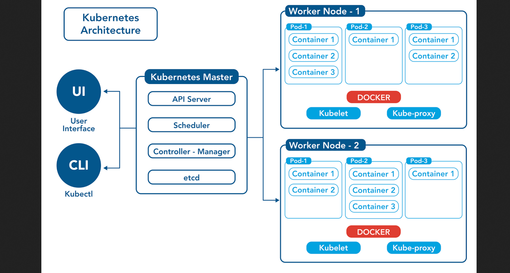
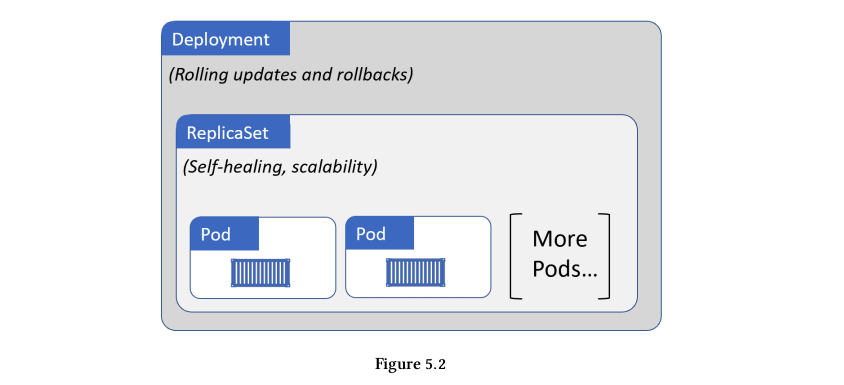
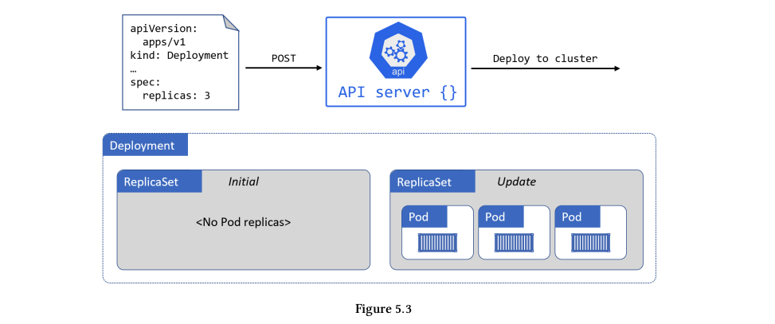
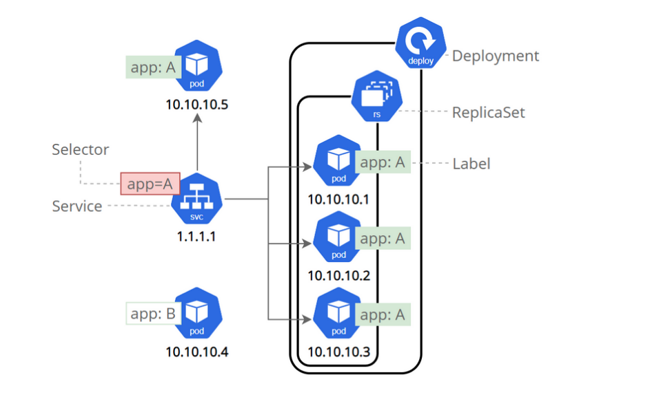

# **Kubernetes vỡ lòng**
## **Nội dung gồm:**
  - [**1. Giới thiệu một số thành phần cơ bản của Kubernetes.**](#1-giới-thiệu-một-số-thành-phần-cơ-bản-của-kubernetes)
  - [**2. Deploy Spring boot application lên Kubernetes.**](#2-deploy-spring-boot-application-lên-kubernetes)
    - [**2.1 Deploy spring boot application với docker**](#21-deploy-spring-boot-application-với-docker)
    - [**2.2 Deploy spring boot application với Kubernetes**](#22-deploy-spring-boot-application-với-kubernetes)
      - [**2.2.1 Chuẩn bị môi trường**](#221-chuẩn-bị-môi-trường)
      - [**2.2.2 Làm việc với các thành phần cơ bản Kubernetes**](#222-làm-việc-với-các-thành-phần-cơ-bản-kubernetes)
        - [**1. Cách define Pod và wraper spring application containers với Pod.**](#1-cách-define-pod-và-wraper-spring-application-containers-với-pod)
          - [**1.1 Define Pod Template**](#11-define-pod-template)
          - [**1.2 Deploy Pod lên kubernetes và một số command cơ bản với Pod.**](#12-deploy-pod-lên-kubernetes-và-một-số-command-cơ-bản-với-pod)
        - [**2. Cách để quản lý các Pods tự động bởi ReplicationController và ReplicaSet**](#2-cách-để-quản-lý-các-pods-tự-động-bởi-replicationcontroller-và-replicaset)
          - [**2.1 Define `ReplicationController` Template:**](#21-define-replicationcontroller-template)
          - [**2.2 Deploy `ReplicationController` lên kubernetes và một số command cơ bản với `ReplicationController`.**](#22-deploy-replicationcontroller-lên-kubernetes-và-một-số-command-cơ-bản-với-replicationcontroller)
          - [**2.3 Define `ReplicaSet` Template:**](#23-define-replicaset-template)
          - [**2.4 Deploy `ReplicaSet` lên kubernetes và một số command cơ bản với `ReplicaSet`.**](#24-deploy-replicaset-lên-kubernetes-và-một-số-command-cơ-bản-với-replicaset)
        - [**3. Deploy spring application với Deployment**](#3-deploy-spring-application-với-deployment)
          - [**3.1 Define Deployment**](#31-define-deployment)
          - [**3.2 Deploy Deployment và một số command cơ bản với Deployment**](#32-deploy-deployment-và-một-số-command-cơ-bản-với-deployment)
        - [**4. Quản lý các biến môi trường với ConfigMap**](#4-quản-lý-các-biến-môi-trường-với-configmap)
          - [**4.1 Define ConfigMap**](#41-define-configmap)
          - [**4.2 Bind các biến trong ConfigMap vào trong Pod thông quan các biến môi trường**](#42-bind-các-biến-trong-configmap-vào-trong-pod-thông-quan-các-biến-môi-trường)
        - [**5. Kubernetes networking**](#5-kubernetes-networking)
        - [**6. Package manager với helm chart**](#6-package-manager-với-helm-chart)
  - [**3. Debug Kubernetes**](#3-debug-kubernetes)
## **1. Giới thiệu một số thành phần cơ bản của Kubernetes.**

Phần này sẽ tập chung giới thiệu một số thành phần cơ bản của Kubernetes và những gì mà Kubernetes có thể làm được.

&#x20;

Trên hình thì thấy `Kubernetes architecture` gồm có như:

**1. Kubernetes Master (Master Node hay control plane).**
   * **API Server**: Trong Kubernetes thì các tương tác giữa các thành phần của kubernetes đều thông qua `API Server`. Khi ta chạy lệnh `kubectl ...` thì cũng là đang tương tác với `API Server` thông qua RestAPI. Ngoài ra `API Server` cũng xử lý các công việc khác như `Authen` -> `Author` -> `Validate YAML`.
   * **Scheduler**: Khi có một cái task cần làm (vd: deploy service A) thì `API server` sẽ assign task cho `Scheduler` để tìm kiếm cái Worker-Node nào phù hợp nhất để service A đc deploy lên. Một vài tiêu chí như: CPU, Memory, Disk,.. .
   * **Controller - Manager**: Ông này thì dùng để quản lý các thành phần như: `Node controller` (quản lý việc healthy của Node), `ReplicationController` (quản lý số lượng Pod), `Endpoint controller` (quản lý các IP của Pod), ..
   * **etcd**: Quản lý các trạng thái của Kubernetes cluster.

**2. Các Worker Node.**
   * **Pod**: Trong `Docker` thì các `containers` sẽ là đơn vị nhỏ nhất là nơi các service chạy. Còn trong `Kubernetes` thì `Pod` lại là đơn vị nhỏ nhất, bên trong `Pod` có thể chứa một hoặc nhiều các `containers`.
   * **Container runtime**: Pod trong Kubernetes sẽ không phải dùng để chạy các application, mà các containers mới là dùng để chạy các application. Pod chỉ là wrap một hoặc nhiều contaiers lại nên sẽ cần có `container runtime` (có thể là Docker, containerd,..) làm nhiệm vụ pulling image, start, stop các containers.
   * **Kubelet**: Ông này có tác dụng là để giao tiếp giữa `Master Node` và `Worker Node`, ngồi trực xem ông `Master Node` có giao cho cái task gì không (VD Deploy 1 service nào đó chẳng hạn), kubelet sẽ dựa trên `PodSpec` đc cung cấp để đảm bảo các các containers chạy đúng như `PodSpec` và report lại cho ông `Master Node`.
   * **Kube-proxy**: https://betterprogramming.pub/k8s-a-closer-look-at-kube-proxy-372c4e8b090

## **2. Deploy Spring boot application lên Kubernetes.**
Phần này sẽ deploy spring boot service từ docker cho đến Kubernetes.

## **2.1 Deploy spring boot application với docker**
API:
```java
package com.thanhnb.demok8s.controllers;

import org.springframework.web.bind.annotation.RequestMapping;
import org.springframework.web.bind.annotation.RequestMethod;
import org.springframework.web.bind.annotation.RestController;

@RestController
public class HelloK8sController {

    @RequestMapping(value = "/hello-k8s", method = RequestMethod.GET)
    public String helloK8s() {
        return "/hello-k8s";
    }
}

```

DockerFile:
```Dockerfile
FROM adoptopenjdk/openjdk11:jdk-11.0.2.9-slim
WORKDIR /opt
COPY build/libs/demo-k8s-0.0.1-SNAPSHOT.jar /opt/app.jar
ENTRYPOINT ["java","-jar","/opt/app.jar"]
```
- **FROM**: Dockerfile thì cần define một cái base image layer, trong trường hợp này là `adoptopenjdk/openjdk11:jdk-11.0.2.9-slim`. Trong image này đã có được cài sẵn JDK11, image layer này sẽ đc làm môi trường để chạy lệnh dưới trong Dockerfile.
- **WORKDIR**: Là sẽ set working directory là folder `/opt`. Các lệnh phía dưới Dockerfile sẽ được thực hiện bên trong folder `/opt`.
- **COPY**: Thực hiện copy file jar từ `build/libs/` vào folder `/opt/`.
- **ENTRYPOINT**: Sẽ chạy câu lệnh `"java","-jar","/opt/app.jar"` bên trong containers.

Build image:
```docker
docker build -t hello-k8s -f Dockerfile .

Sending build context to Docker daemon  36.87MB
Step 1/4 : FROM adoptopenjdk/openjdk11:jdk-11.0.2.9-slim
 ---> 9a223081d1a1  
 
# Xong step 1/4 lệnh trên thì được image layer ID: 9a223081d1a1
                                        
Step 2/4 : WORKDIR /opt
 ---> Running in 5f2907646b58
Removing intermediate container 5f2907646b58
 ---> aa838cbddba9

# Step 2 được chạy trong container ID: 5f2907646b58, chạy xong step 2 thì containerID: 5f2907646b58 cũng bị xóa.

Step 3/4 : COPY build/libs/demo-k8s-0.0.1-SNAPSHOT.jar /opt/app.jar
 ---> 8552b72f0e54

# Step 3 chạy xong thì được image layer ID: 8552b72f0e54

Step 4/4 : ENTRYPOINT ["java","-jar","/app.jar"]
 ---> Running in cac2e3c2fc04
Removing intermediate container cac2e3c2fc04
 ---> 057e1422ad43

# Step 4 đc chạy trong containers ID: cac2e3c2fc04, chạy xong thì bị xóa và ra đc image layer ID: 057e1422ad43

Successfully built 057e1422ad43
Successfully tagged hello-k8s:latest

# Gắn tag: hello-k8s:latest cho image layer: 057e1422ad43 và kết thúc build docker image.

docker image -a

REPOSITORY                                               TAG                 IMAGE ID       CREATED          SIZE
hello-k8s                                                latest              057e1422ad43   50 seconds ago   395MB
<none>                                                   <none>              aa838cbddba9   51 seconds ago   358MB
<none>                                                   <none>              8552b72f0e54   51 seconds ago   395MB
adoptopenjdk/openjdk11                                   jdk-11.0.2.9-slim   9a223081d1a1   3 years ago      358MB

# Các image layer sẽ được stack lên nhau, càng nhiều layer thì image đó càng to. Image layer này cũng đc dùng để cached, để lần sau build image thì sẽ nhanh hơn.
```
Run container:
```Docker
docker ps
docker run --name hello-k8s -p 8080:8080 hello-k8s:latest

CONTAINER ID   IMAGE              COMMAND                  CREATED          STATUS             PORTS                                                  NAMES
603a3a05ba43   hello-k8s:latest   "java -jar /opt/app.…"   28 seconds ago   Up 27 seconds      0.0.0.0:8080->8080/tcp, :::8080->8080/tcp              hello-k8s
97e96887af2a   mysql:5.7          "docker-entrypoint.s…"   21 hours ago     Up About an hour   0.0.0.0:3306->3306/tcp, :::3306->3306/tcp, 33060/tcp   demok8s_db_1
```

Push docker image lên dockerhub:
```docker
docker tag hello-k8s:latest thanhnb1/hello-k8s:latest

docker push thanhnb1/hello-k8s:latest
The push refers to repository [docker.io/thanhnb1/hello-k8s]
89434e77b260: Pushed 
8b338a10df53: Mounted from adoptopenjdk/openjdk11 
238b684bbac1: Mounted from adoptopenjdk/openjdk11 
faed2c48e448: Mounted from adoptopenjdk/openjdk11 
b57c79f4a9f3: Mounted from adoptopenjdk/openjdk11 
d60e01b37e74: Mounted from adoptopenjdk/openjdk11 
e45cfbc98a50: Mounted from adoptopenjdk/openjdk11 
762d8e1a6054: Mounted from adoptopenjdk/openjdk11 
latest: digest: sha256:018c1ae845eb007936172ff901a0fc492ea66714d497590214474e6561bc6b2e size: 1994
```
## **2.2 Deploy spring boot application với Kubernetes**

## **2.2.1 Chuẩn bị môi trường**

Ở local thì để tạo nhanh Kubernetes cluster thì có thể dùng [MicroK8s](https://microk8s.io/docs/getting-started) hoặc là [MiniKube](https://computingforgeeks.com/how-to-install-minikube-on-ubuntu-debian-linux/) đều được.

Mình thì đang dùng `MicroK8s` để tạo Kubernetes Cluster ở local. Khi nào dùng thì start lên, không dùng thì stop là xong.
```
nbt@nbt:~$ microk8s start
[sudo] password for nbt: 
Started.

nbt@nbt:~$ microk8s stop
Stopped.
```
## **2.2.2 Làm việc với các thành phần cơ bản Kubernetes**

## **1. Cách define Pod và wraper spring application containers với Pod.** 
  
### **1.1 Define Pod Template**
PodTemplate sẽ được chia thành: `apiVersion`, `kind`, `metadata`, `spec`.
  ```yaml
  apiVersion: v1
  kind: Pod # là một loại Object trong Kubernetes.
  # Phần `metadata` là mô tả về Pod.
  metadata:
    name: hello-k8s  # Tên Pod là gì?
    namespace: default # Pod này đc deploy ở namespace nào?
    labels:           # Define các labels của Pod.  
      app: hello-k8s
  # Phần `spec` này là defile các containers bên trong Pod. 1 Pod có thể chứa 1 hoặc nhiều container. 
  spec:
    containers:
    - name: hello-k8s  # Tên container là gì?
      image: thanhnb1/hello-k8s:latest # image dùng cho container là gì?
      resources: # Phần này định nghĩa các request và limit các resource của container.
        limits:
          cpu: 200m
          memory: 500Mi
        requests:
          cpu: 100m
          memory: 200Mi
      env: # Define các biến môi trường dùng cho container. Sau sẽ dùng configMap.
      - name: SERVER_PORT
        value: "8080"
      - name: ENV
        value: dev
      - name: DATABASE_URL
        value: jdbc:mysql://localhost:3306/hello_k8s?autoReconnect=true&useSSL=false
      - name: DATABASE_USER
        value: root
      - name: DATABASE_PASSWORD
        value: password
      ports:
      - containerPort: 8080 # application bên trong container chạy port là gì?
        name:  http
    restartPolicy: Always
  ```
### **1.2 Deploy Pod lên kubernetes và một số command cơ bản với Pod.**
  ```shell
  # Để deploy Pod lên K8s thì dùng lệnh "kubectl apply -f <path file Pod template> -n <namespace>"
  kubectl apply -f pod-hello-k8s.yaml 
  pod/hello-k8s created
  
  # Xem các Pod: "kubectl get po -n <namespace>"
  kubectl get po
  NAME         READY   STATUS       RESTARTS          AGE
  hello-k8s    1/1     Running      0                 6s

  # Xem IP của Pod: kubectl get po -o wide
  NAME      READY   STATUS             RESTARTS         AGE     IP              NODE   NOMINATED NODE   READINESS GATES
  hello-k8s 1/1     Running            0                7m32s   10.1.28.72      nbt    <none>           <none>

  # Xem chi tiết Pod: "kubectl describe po <tên pod>"
  # Xem logs của Pod: "kubectl logs -f --tail 500 -n <namespace> <tên pod>"
  # Xem các biến môi trường bên trong container:
  #  - Thực hiện access vào bên trong Pod, thêm tham số -c nếu Pod có nhiều containers.
  #  - Thực hiện lệnh printenv để xem các biên môi trường.

  # Cái IP "10.1.28.72" của Pod sẽ đc assigned cho Pod khi tạo và khi Pod bị xóa thì IP này cũng sẽ thay đổi. IP của Pod là không có định, mỗi lần xóa đi tạo lại Pod thì sẽ đc assigned IP mới.
  # Có 2 cách để có thể truy cập vào Pod: 
  # 1. Sử dụng port-forward: "kubectl port-forward <tên pod> <Port-Local>:<Port-container>"

    kubectl port-forward hello-k8s 8080:8080
    Forwarding from 127.0.0.1:8080 -> 8080
    Forwarding from [::1]:8080 -> 8080
    Handling connection for 808

    # test
    curl http://localhost:8080/hello-k8s
    /hello-k8s

  # 2. Gọi Pod này từ một Pod khác thông qua IP của Pod.
      kubectl get po -o wide
      NAME              READY   STATUS             RESTARTS          AGE   IP              NODE   NOMINATED NODE   READINESS GATES
      pod-for-test      1/1     Running            62 (25m ago)      46d   10.1.28.113     nbt    <none>           <none>
      hello-k8s         1/1     Running            0                 19m   10.1.28.72      nbt    <none>           <none>

    # Thực hiện access vào Pod: pod-for-test để call sang pod: hello-k8s theo IP
    kubectl exec -it po/pod-for-test sh

    # Cài curl để test;
    apk update && apk upgrade && apk add curl

    # Call Pod: hello-k8s 
    / # curl http://10.1.28.72:8080/hello-k8s
    /hello-k8s/ #
  
  # Xóa Pod: "kubectl delete po/<tên pod>"
  kubectl delete po/hello-k8s
  pod "hello-k8s" deleted
  
  # Xóa pod thì không còn thấy Pod hello-k8s không đc tạo lại.
  ```
## **2. Cách để quản lý các Pods tự động bởi ReplicationController và ReplicaSet**
  
  Ở phần trước thì đã tạo Pod bằng podTemplate (file yaml), deploy Pod lên kubernetes, thử xóa Pod thì không thấy nó đc tạo lại. Giờ mà muốn quản lý được số lượng instance (số lượng Pod) luôn ở số lượng mong muốn và khi Pod bị vấn đề gì đó mà bị xóa thì Kubernetes phải tạo lại tự động. Kubernetes sẽ sử dụng `ReplicaSet`, `ReplicationController` để thực hiện những yêu cầu trên.

### **2.1 Define `ReplicationController` Template:**
  ```yml
  apiVersion: v1
  kind: ReplicationController # Loại object là: `ReplicationController`.
  metadata:
    name: hello-k8s # Tên của ReplicationController.

  # Phần `spec` này là chứa thông tin số lượng Pod muong muốn replicas=3 (3 Pod).
  # `selector`: `ReplicationController` cần phải biết nó theo dõi cái Pod nào giữa rất nhiều Pod trên Cluster?,
  # `ReplicationController` sẽ sử dụng `selector`. Trong `selector` thì mô tả labels của Pod sẽ theo dõi ở đây là: `app: hello-k8s`.
  # Những cái pod nào mà có labels là: `app: hello-k8s` thì sẽ được `ReplicationController` theo dõi. Theo dõi ở đây có nghĩa là luôn nhìn các
  # pod mà match labels, nếu pod bị xóa thì sẽ tạo lại một pod mới như mô tả ở phần `spect` template. 
  spec:
    replicas: 3 # Số lượng instance muong muốn ở đây là 3.
    selector:
      app: hello-k8s
    template:
      metadata:
        name: hello-k8s
        labels:
          app: hello-k8s
      
      # Khi mà Pod bị xóa thì `ReplicationController` sẽ thực hiện tạo lại.
      # `ReplicationController` sẽ sử dụng phần `spec` để tạo lại Pod, sẽ tạo
      # lại một cái Pod như trong `spec` mô tả.        
      spec:
        containers:
        - name: hello-k8s
          image: thanhnb1/hello-k8s:latest
          ports:
          - containerPort: 8080
  ```
### **2.2 Deploy `ReplicationController` lên kubernetes và một số command cơ bản với `ReplicationController`.**
  ```powershell
  kubectl apply -f replication-controller.yaml -n demo
  replicationcontroller/hello-k8s created

  # get all resources trong namespace.
  kubectl get all -n demo
  NAME                  READY   STATUS    RESTARTS   AGE
  pod/hello-k8s-b4wfh   1/1     Running   0          25s
  pod/hello-k8s-5cpdk   1/1     Running   0          25s
  pod/hello-k8s-z4bdp   1/1     Running   0          25s
  
  # số Pod mong muốn DESIRED(3), số Pod thực tế CURRENT(3), sô lương pod READY(3).
  NAME                              DESIRED   CURRENT   READY   AGE
  replicationcontroller/hello-k8s   3         3         3       25s

  # Giờ thử delete Pod đi xem thằng `ReplicationController` có tạo lại không.
  kubectl delete po/hello-k8s-z4bdp -n demo
  pod "hello-k8s-z4bdp" deleted

  # Theo dõi event
  kubectl get po -n demo -w
  NAME              READY   STATUS    RESTARTS   AGE
  hello-k8s-b4wfh   1/1     Running   0          5m22s
  hello-k8s-5cpdk   1/1     Running   0          5m22s
  hello-k8s-z4bdp   1/1     Running   0          5m22s

  hello-k8s-z4bdp   1/1     Terminating   0          5m37s
  hello-k8s-2qkq8   0/1     Pending       0          0s
  hello-k8s-2qkq8   0/1     Pending       0          0s
  hello-k8s-2qkq8   0/1     ContainerCreating   0          0s
  hello-k8s-z4bdp   1/1     Terminating         0          5m38s
  hello-k8s-2qkq8   0/1     ContainerCreating   0          1s
  hello-k8s-z4bdp   0/1     Terminating         0          5m39s
  hello-k8s-z4bdp   0/1     Terminating         0          5m39s
  hello-k8s-z4bdp   0/1     Terminating         0          5m39s
  hello-k8s-2qkq8   1/1     Running             0          4s

  # Thấy pod "hello-k8s-2qkq8" đã được tạo mới. Chứng tỏ là `ReplicationController` cũng hoạt động ấy chứ.

  # Scale UP POD với ReplicationController. Tăng số Pod lên 5(--replicas=5) => 2 Pod mới đc tạo thêm.
  kubectl scale replicationcontroller/hello-k8s --replicas=5 -n demo
  replicationcontroller/hello-k8s scaled

  kubectl get all -n demo
  NAME                  READY   STATUS    RESTARTS   AGE
  pod/hello-k8s-hrzfd   1/1     Running   0          58s
  pod/hello-k8s-5h7n9   1/1     Running   0          58s
  pod/hello-k8s-4jpd5   1/1     Running   0          58s

  # Thấy 2 Pod này đc tạo thê.
  pod/hello-k8s-fgzdg   1/1     Running   0          8s
  pod/hello-k8s-prrst   1/1     Running   0          8s
  
  NAME                              DESIRED   CURRENT   READY   AGE
  replicationcontroller/hello-k8s   5         5         5       58s

  # Scale DOWN POD với ReplicationController. Scale Pod --replicas=2 thì sẽ có 3 Pod bị xóa đi, số lượng Pod còn lại là 2.
  kubectl scale replicationcontroller/hello-k8s --replicas=2 -n demo
  replicationcontroller/hello-k8s scaled

  kubectl get all -n demo
  NAME                  READY   STATUS    RESTARTS   AGE
  pod/hello-k8s-5h7n9   1/1     Running   0          3m17s
  pod/hello-k8s-4jpd5   1/1     Running   0          3m17s
  
  NAME                              DESIRED   CURRENT   READY   AGE
  replicationcontroller/hello-k8s   2         2         2       3m17s


  # `ReplicationController` sẽ theo dõi Pod theo labels, giờ thử sửa labels selector xem thế nào.
  ...
  apiVersion: v1
  kind: ReplicationController
  metadata:
    name: hello-k8s # Tên của ReplicationController.
  spec:
    replicas: 3    # Số lượng instance muong muốn ở đây là 3.
    selector:
      app: hello-k8s-fake # đây là `labels selector`(app: hello-k8s-fake) đang không match với label của Pod(app: hello-k8s).
    template:
      metadata:
        name: hello-k8s
        labels:
          app: hello-k8s    
      spec:
        containers:
        - name: hello-k8s
          image: thanhnb1/hello-k8s:latest
          ports:
          - containerPort: 8080

  # Thử apply mới `ReplicationController` sau khi sửa xem sao. Kết quả là nó méo cho apply luôn, khôn phết ấy chứ =))
  kubectl apply -f replication-controller.yaml -n demo
  The ReplicationController "hello-k8s" is invalid: spec.template.metadata.labels: Invalid value: map[string]string{"app":"hello-k8s"}: `selector` does not match template `labels`

  # Khi xóa `ReplicationController` thì các Pod được tạo bởi `ReplicationController` thì sẽ bị xóa.
  ```
### **2.3 Define `ReplicaSet` Template:**
  ```yml
  apiVersion: apps/v1
  kind: ReplicaSet
  metadata:
    name: hello-k8s
    labels:
      app: hello-k8s
  spec:
    replicas: 3
    selector:
      matchLabels:
        app: hello-k8s
    template:
      metadata:
        labels:
          app: hello-k8s
      spec:
        containers:
        - name: hello-k8s
          image: thanhnb1/hello-k8s:latest
          ports:
          - containerPort: 8080
  ```
### **2.4 Deploy `ReplicaSet` lên kubernetes và một số command cơ bản với `ReplicaSet`.**
  ```powershell
  kubectl get all -n demo
  NAME                  READY   STATUS    RESTARTS   AGE
  pod/hello-k8s-2s9sh   1/1     Running   0          15s
  pod/hello-k8s-gqnt4   1/1     Running   0          15s
  pod/hello-k8s-2hg6r   1/1     Running   0          15s
  
  NAME                        DESIRED   CURRENT   READY   AGE
  replicaset.apps/hello-k8s   3         3         3       15s
  ```
  **Điểm khác nhau giữa `ReplicaSet` và `ReplicationController`.**

  `ReplicaSet` là thế hệ sau của `ReplicationController` nên `ReplicaSet` sẽ có đầy đủ các tính chất của `ReplicationController`, có thêm điểm khác như: `ReplicaSet` có cái selector khác với `ReplicationController`. Có thể math nhiều hơn 1 labels khi sử dụng `matchExpressions`, có nhiều `operator` như: In, NotIn, Exists, DoesNotExist.

  `ReplicaSet` file:
  ```yml
  ...
  spec:
  replicas: 3
  selector:
    matchLabels:
      app: hello-k8s
  ...
  # sử dụng `matchExpressions` để math nhiều hơn 1 labels.
  spec:
  replicas: 3
  selector:
    matchExpressions:
      - key: env
        operator: In
        values:
          - develop
          - staging
  ...
  ```
  `ReplicationController` file:
  ```yml
  ...
  spec:
  replicas: 3
  selector:       # Sẽ select các Pod có labels là: `app: hello-k8s` và `env: develop`, chỉ là equal.
    app: hello-k8s
    env: develop
  template:
    metadata:
      name: hello-k8s
      labels:
        app: hello-k8s
  ...
  ```
  **Demo:**
  ```powershell
  kubectl apply -f pod-develop.yaml -n demo
  pod/hello-k8s-develop created

  kubectl apply -f pod-staging.yaml -n demo
  pod/hello-k8s-stating created

  kubectl apply -f replicaset-match-multiple-labels.yaml -n demo
  replicaset.apps/hello-k8s created

  kubectl get po -n demo -w
  NAME                READY   STATUS    RESTARTS   AGE

  # Pod này được tạo do thực hiện: "kubectl apply -f pod-develop.yaml -n demo"
  hello-k8s-develop   1/1     Running   0          43s

  # Pod này được tạo do thực hiện: "kubectl apply -f pod-staging.yaml -n demo"
  hello-k8s-stating   1/1     Running   0          39s

  # Pod này được tạo do thực hiện: "kubectl apply -f replicaset-match-multiple-labels.yaml -n demo"
  # replicaset này có replicaSet=3, đang ra khi apply lệnh này thì phải tạo ra 3 Pod nữa chứ. Nhưng vì
  # `matchExpressions` đã bao gồm cả 2 Pod trước đó, nên khi apply lệnh này thì sẽ chỉ tạo thêm 1 Pod nữa thôi.
  hello-k8s-vdqwj     1/1     Running   0          4s

  kubectl get po --show-labels -n demo
  NAME                READY   STATUS    RESTARTS       AGE   LABELS
  hello-k8s-stating   1/1     Running   1 (100m ago)   10h   app=hello-k8s,env=staging
  hello-k8s-vdqwj     1/1     Running   1 (100m ago)   10h   app=hello-k8s,env=develop
  hello-k8s-develop   1/1     Running   1 (100m ago)   10h   app=hello-k8s,env=develop
  ```
  **Update podTemplate của các Pod được quản lý bởi ReplicaSet**

  Thực hiện update các Pods hiện tại lên một version mới từ `thanhnb1/hello-k8s:latest` sang `thanhnb1/hello-k8s:v2`.
  ```yml
  apiVersion: apps/v1
  kind: ReplicaSet
  metadata:
    name: hello-k8s
    labels:
      app: hello-k8s
  spec:
    replicas: 3
    selector:
      matchExpressions:
        - key: env
          operator: In
          values:
            - develop
            - staging
    template:
      metadata:
        labels:
          app: hello-k8s
          env: develop
      spec:
        containers:
        - name: hello-k8s
          image: thanhnb1/hello-k8s:v2
          ports:
          - containerPort: 8080
  ```
  **Demo**
  ```powershell

  # Trước khi update podTemplate với ReplicaSet.
  kubectl get all -n demo
  NAME                    READY   STATUS    RESTARTS        AGE
  pod/hello-k8s-stating   1/1     Running   1 (5h50m ago)   14h
  pod/hello-k8s-vdqwj     1/1     Running   1 (5h50m ago)   14h
  pod/hello-k8s-develop   1/1     Running   1 (5h50m ago)   14h
  
  NAME                        DESIRED   CURRENT   READY   AGE
  replicaset.apps/hello-k8s   3         3         3       14h
  
  # Thực hiện describe Pod để xem các thông tin chi tiết của Pod.
  kubectl describe pod/hello-k8s-develop -n demo
  ...
  Controlled By:  ReplicaSet/hello-k8s
  Containers:
    hello-k8s:
      Container ID:   containerd://66fd56caa9cc82992484e7110ba8da0938a65cf9250dbf425e6de613bc66cc4e
      Image:          thanhnb1/hello-k8s:latest
  ...

  # Thực hiện update podTemplate: update image từ `thanhnb1/hello-k8s:latest` => `thanhnb1/hello-k8s:v2`.
  kubectl apply -f update-pod-new-version-replicaset.yaml -n demo
  replicaset.apps/hello-k8s configured

  # Xem Pod sau khi update podTemplate. Trong nó không có gì thay đổi nhỉ?
  kubectl get all -n demo
  NAME                    READY   STATUS    RESTARTS        AGE
  pod/hello-k8s-stating   1/1     Running   1 (5h50m ago)   14h
  pod/hello-k8s-vdqwj     1/1     Running   1 (5h50m ago)   14h
  pod/hello-k8s-develop   1/1     Running   1 (5h50m ago)   14h
  
  NAME                        DESIRED   CURRENT   READY   AGE
  replicaset.apps/hello-k8s   3         3         3       14h

  # Thực hiện describe Pod xem các Pod đang chạy image nào? đã update image version hay chưa?
  # Kết quả là kể cả sau khi update podTemplate thì vẫn không có gì thay đổi, Pod vẫn chạy image cũ(thanhnb1/hello-k8s:latest).
  ...
  Controlled By:  ReplicaSet/hello-k8s
  Containers:
    hello-k8s:
      Container ID:   containerd://66fd56caa9cc82992484e7110ba8da0938a65cf9250dbf425e6de613bc66cc4e
      Image:          thanhnb1/hello-k8s:latest
  ...

  # Thực hiện xóa 1 Pod đi, xem Pod mới đc tạo ra có chạy image version mới hay chưa?
  kubectl delete pod/hello-k8s-develop -n demo
  pod "hello-k8s-develop" deleted

  kubectl get all -n demo
  NAME                    READY   STATUS    RESTARTS        AGE
  pod/hello-k8s-stating   1/1     Running   1 (5h59m ago)   14h
  pod/hello-k8s-vdqwj     1/1     Running   1 (5h59m ago)   14h
  pod/hello-k8s-t6fbm     1/1     Running   0               11s

  # Thực hiện describe pod mới đc tạo xem có chạy image mới hay chưa?
  kubectl describe pod/hello-k8s-t6fbm -n demo
  ...
  Controlled By:  ReplicaSet/hello-k8s
  Containers:
    hello-k8s:
      Container ID:   containerd://a5863c96ecdd97403593dc48e7841bca2cd254ed8712d45a7b24794fd964883d
      Image:          thanhnb1/hello-k8s:v2
  ...
 # Kết quả là Pod mới đc tạo thì đã chạy image version mới (thanhnb1/hello-k8s:v2),
 # còn mấy ông Pod cũ thì vẫn chạy image version cũ (thanhnb1/hello-k8s:latest).
 # Thế này thì mỗi lần update podTemplate thì to tay để đi xóa các Pod cũ để nó tự tạo Pod mới thì mới ăn đc cái update.
 # Thế này thì tù qué, phần sau nói về  `Deployment` thì `Deployment` sẽ giải quyết các vấn đề trên nha.
  ```

## **3. Deploy spring application với Deployment**


Ở phần 1 thì mình tạo ra `Pod` để wrap container rồi deploy lên kubernetes, nhưng `Pod` bị cái là không tự self-healing được (`Pod` bị xóa thì không tự tạo lại được). Sang đến phần 2 thì nâng cấp hơn sử dụng `ReplicationController` và `ReplicaSet` để quản lý cac `Pod` thông qua việc matchLabels, và cũng thực hiện scale-up hoặc scale-down Pod, Nhưng `ReplicationController` và `ReplicaSet` cũng bị một cái là khi thực hiện update podTemplate thì nó không tự update đc, mà phải tự xóa các pod bằng tay, để `ReplicationController` và `ReplicaSet` đi tạo lại Pod, lúc này các Pod đc tạo lại thì mới đc update podTemplate. Những vấn đề của `ReplicationController` và `ReplicaSet` sẽ đc giải quyết bởi `Deployment`.

Về bản chất thì `Deployment` vẫn sẽ sử dụng `ReplicaSet` cho việc self-healing và scalability. Mỗi lần tạo 1 `Deployment` thì sẽ tạo mới 1 `ReplicaSet` cũng được tạo theo.


### **3.1 Define Deployment**
```yml
apiVersion: apps/v1
kind: Deployment
metadata:
  name: hello-k8s
  labels:
    app: hello-k8s
spec:
  selector:
    matchLabels:
      app: hello-k8s
  replicas: 1
  strategy:
    rollingUpdate:
      maxSurge: 25%
      maxUnavailable: 25%
    type: RollingUpdate
  template:
    metadata:
      labels:
        app: hello-k8s
    spec:
      containers:
        - name: hello-k8s
          image: thanhnb1/hello-k8s:latest
          resources:
            requests:
              cpu: 100m
              memory: 100Mi
            limits:
              cpu: 100m
              memory: 100Mi
          ports:
            - containerPort: 8080
```
### **3.2 Deploy Deployment và một số command cơ bản với Deployment**
```powershell
# Thực hiện apply file depoyment.
kubectl apply -f 1.deployment.yaml -n demo
deployment.apps/hello-k8s created

# Thực hiện get all các resources. Khi deploy cái deployment thì có luôn replicaSet.
kubectl get all -n demo
NAME                             READY   STATUS    RESTARTS   AGE
pod/hello-k8s-6d8d7d9588-vqxxx   1/1     Running   0          7s

NAME                        READY   UP-TO-DATE   AVAILABLE   AGE
deployment.apps/hello-k8s   1/1     1            1           7s

NAME                                   DESIRED   CURRENT   READY   AGE
replicaset.apps/hello-k8s-6d8d7d9588   1         1         1       7s

# Thực hiện update podTemplate, từ `thanhnb1/hello-k8s:latest` thành `thanhnb1/hello-k8s:v2`.
kubectl apply -f 1.deployment.yaml -n demo
deployment.apps/hello-k8s configured

# Sau khi Update podTemplate, replicaset mới sẽ đc tạo ra.
kubectl get all -n demo
NAME                             READY   STATUS        RESTARTS   AGE
pod/hello-k8s-54cc866d55-6qnst   1/1     Running       0          5s

NAME                        READY   UP-TO-DATE   AVAILABLE   AGE
deployment.apps/hello-k8s   1/1     1            1           8m17s

NAME                                   DESIRED   CURRENT   READY   AGE
replicaset.apps/hello-k8s-54cc866d55   1         1         1       2m8s
replicaset.apps/hello-k8s-6d8d7d9588   0         0         0       8m17s

# Pod `hello-k8s-6d8d7d9588-ssc5h` này bị xóa và `hello-k8s-54cc866d55-6qnst` được tạo mới tự đông.
kubectl get po -n demo -w
NAME                         READY   STATUS    RESTARTS   AGE
hello-k8s-6d8d7d9588-ssc5h   1/1     Running   0          71s
hello-k8s-54cc866d55-6qnst   0/1     Pending   0          0s
hello-k8s-54cc866d55-6qnst   0/1     Pending   0          0s
hello-k8s-54cc866d55-6qnst   0/1     ContainerCreating   0          0s
hello-k8s-54cc866d55-6qnst   0/1     ContainerCreating   0          0s
hello-k8s-54cc866d55-6qnst   1/1     Running             0          3s
hello-k8s-6d8d7d9588-ssc5h   1/1     Terminating         0          85s
hello-k8s-6d8d7d9588-ssc5h   1/1     Terminating         0          115s
hello-k8s-6d8d7d9588-ssc5h   0/1     Terminating         0          116s
hello-k8s-6d8d7d9588-ssc5h   0/1     Terminating         0          116s
hello-k8s-6d8d7d9588-ssc5h   0/1     Terminating         0          116s

# Deployment có thêm cái nữa là rollback lại version cũ, đó là lý do tại sao mỗi lần update deployment thì 1 cái replicaSet mới đc tạo.
kubectl rollout history deployment/hello-k8s -n demo
deployment.apps/hello-k8s 
REVISION  CHANGE-CAUSE
3         <none>
4         <none>

# rollback về một version nào trước đó.
kubectl rollout undo deployment/hello-k8s --to-revision=3 -n demo
deployment.apps/hello-k8s rolled back

# Thêm note `CHANGE-CAUSE` để sau dễ dang rollback hơn.
...
apiVersion: apps/v1
kind: Deployment
metadata:
  name: hello-k8s
  annotations:
    kubernetes.io/change-cause: "update image from latest to v2"
...

hoặc là: 
kubectl annotate deployment awesome-app kubernetes.io/change-cause="note here"

# Show history
kubectl rollout history deployment/hello-k8s -n demo
deployment.apps/hello-k8s 
REVISION  CHANGE-CAUSE
5         <none>
6         update image from latest to v2
```
## **4. Quản lý các biến môi trường với ConfigMap**
Thường các application sẽ có các biến môi trường để có thể tùy biến theo tường môi trường khi deploy. Nếu mà không có các biến môi trường thì khi muốn update các giá trị bên trong file config thì sẽ phải build lại image mới. Kubernetes có một Object để quản lý các biến môi trường này đó là: ConfigMap.
### **4.1 Define ConfigMap**
```yml
kind: ConfigMap
apiVersion: v1
metadata:
  name: hello-k8s
data:
  ENV: dev
  DATABASE_URL: jdbc:mysql://localhost:3306/hello_k8s?autoReconnect=true&useSSL=false
  DATABASE_USER: root
  DATABASE_PASSWORD: password
```
### **4.2 Bind các biến trong ConfigMap vào trong Pod thông quan các biến môi trường**
```yml
apiVersion: apps/v1
kind: Deployment
metadata:
  name: hello-k8s
  annotations:
    kubernetes.io/change-cause: "update image from latest to v2"
  labels:
    app: hello-k8s
spec:
  selector:
    matchLabels:
      app: hello-k8s
  replicas: 1
  strategy:
    rollingUpdate:
      maxSurge: 25%
      maxUnavailable: 25%
    type: RollingUpdate
  template:
    metadata:
      labels:
        app: hello-k8s
    spec:
      containers:
        - name: hello-k8s
          image: thanhnb1/hello-k8s:v3
          resources:
            limits:
              cpu: 200m
              memory: 500Mi
            requests:
              cpu: 100m
              memory: 200Mi

          # Đây là phần bind các biến môi trường vào trong Pod từ configMap.    
          env:
            - name: ENV # Tên biến môi trường.
              valueFrom: # được lấy từ đâu?
                configMapKeyRef: # Lấy ở configMap có tên là: hello-k8s theo key: ENV
                  name: hello-k8s
                  key: ENV
            - name: DATABASE_URL
              valueFrom:
                configMapKeyRef:
                  name: hello-k8s
                  key: DATABASE_URL
            - name: DATABASE_USER
              valueFrom:
                configMapKeyRef:
                  name: hello-k8s
                  key: DATABASE_USER
            - name: DATABASE_PASSWORD
              valueFrom:
                configMapKeyRef:
                  name: hello-k8s
                  key: DATABASE_PASSWORD
          ports:
            - containerPort: 8080
```
**Demo**
```powershell
# apply file configMap
kubectl apply -f hello-k8s-configMap-env.yaml -n demo
configmap/hello-k8s created

# apply file deployment
kubectl apply -f hello-k8s-configmap-env.yaml -n demo
deployment.apps/hello-k8s created

# Xem các biên môi trường bên trong Pod.
kubectl exec -it pod/hello-k8s-cd59f95ff-hkf2l -n demo sh
kubectl exec [POD] [COMMAND] is DEPRECATED and will be removed in a future version. Use kubectl exec [POD] -- [COMMAND] instead.
# printenv
# Biên môi trường trong configMap đã đc bind vào bên trong Pod.
DATABASE_USER=root
KUBERNETES_PORT=tcp://10.152.183.1:443
KUBERNETES_SERVICE_PORT=443
DATABASE_URL=jdbc:mysql://localhost:3306/hello_k8s?autoReconnect=true&useSSL=false
...

# Call thử API:
# curl http://localhost:8080/v2/get-all-env
ApplicationConfigs{env='dev', dataSourceUrl='jdbc:mysql://localhost:3306/hello_k8s?autoReconnect=true&useSSL=false', userName='root', password='password'}
#

# Thực hiên Update các biên môi trường.
ENV: staging
DATABASE_URL: jdbc:mysql://localhost:3306/hello_k8s?autoReconnect=true&useSSL=false
DATABASE_USER: root
DATABASE_PASSWORD: password

kubectl apply -f hello-k8s-configMap-env.yaml -n demo
configmap/hello-k8s configured

# Khi update các biến môi trường thì sẽ phải rollout lại deployment.
kubectl rollout restart deployment/hello-k8s -n demo
deployment.apps/hello-k8s restarted

kubectl exec -it pod/hello-k8s-68bcbcf7dd-jpxgd -n demo sh
kubectl exec [POD] [COMMAND] is DEPRECATED and will be removed in a future version. Use kubectl exec [POD] -- [COMMAND] instead.
# printenv
DATABASE_USER=root
DATABASE_URL=jdbc:mysql://localhost:3306/hello_k8s?autoReconnect=true&useSSL=false
ENV=staging
DATABASE_PASSWORD=password
...
# Kết quả là biến môi trường đã đc update.
```
## **5. Kubernetes networking**
Phần này sẽ nói về cách mà các service trong Kubernetes cluster có thể gọi nhau. Cách truy cập service từ bên ngoài Kuberentes cluster.


Ở các phần trước thì nói về `Pod`, truy cập các `Pod` bằng cách dùng port-forward, hoặc là vào `Pod` A gọi `Pod` B thông qua IP. Nhưng có vấn đề là cái IP của `Pod` sẽ bị thay đổi, nếu `Pod` bị xóa đi tạo lại. Giả sử có app-A gọi app-B mà dùng IP của `Pod` thì toang vì IP sẽ bị thay đổi như trên. Thì Kubernetes sẽ phải đẻ ra một ông nào đấy để giải quyết vấn để trên. Thì ngôi sao sáng ở phần này là `Service`. `Service` có đặc điểm là sẽ có IP không thay đổi, mặc dù cho các `Pod` có bị xóa đi tạo lại. `Service` sẽ select các `Pod` thông qua labels. Muốn tìm hiểu thêm về Service có thể xem [ở đây](https://github.com/nbthanh98/study/tree/master/learn-k8s/3.core-components/3.3-service).
### **5.1 Truy cập service từ bên ngoài Cluster**
Để mà truy cập service từ bên ngoài Cluster thì sử dụng serviceType = NodePort hoặc dùng Ingress.
**Define service**
```yml
apiVersion: v1
kind: Service
metadata:
  name: hello-k8s
spec:
  type: NodePort
  selector:
    app: hello-k8s
  ports:
    - protocol: TCP
      port: 80
      targetPort: 8080
      nodePort: 32000
```
**Demo**
```powershell
kubectl get all -n demo
NAME                             READY   STATUS    RESTARTS   AGE
pod/hello-k8s-7f778c9df9-wj9t2   1/1     Running   0          8m44s

# Đây là service mới tạo ra. NodePort có nghĩa là sẽ truy cập được service thông qua port của Node. (30000 ->32000)
NAME                TYPE       CLUSTER-IP      EXTERNAL-IP   PORT(S)        AGE
service/hello-k8s   NodePort   10.152.183.47   <none>        80:32000/TCP   8m28s

NAME                        READY   UP-TO-DATE   AVAILABLE   AGE
deployment.apps/hello-k8s   1/1     1            1           8m44s

NAME                                   DESIRED   CURRENT   READY   AGE
replicaset.apps/hello-k8s-7f778c9df9   1         1         1       8m44s

# Lấy endpoint, IP: 10.1.28.81:8080 chính là IP của Pod mà service selected đc thông qua labels, nếu có nhiều Pod thì sẽ là 1 list IP.
kubectl get ep -n demo
NAME        ENDPOINTS         AGE
hello-k8s   10.1.28.81:8080   3m34s

# Để ý thì thấy IP của Pod đang giông với ENDPOINTS ở phía trên.
kubectl get po -n demo -o wide
NAME                         READY   STATUS    RESTARTS   AGE    IP           NODE   NOMINATED NODE   READINESS GATES
hello-k8s-7f778c9df9-wj9t2   1/1     Running   0          4m6s   10.1.28.81   nbt    <none>           <none>

# Lấy service:
kubectl get svc -n demo -o wide
NAME        TYPE       CLUSTER-IP      EXTERNAL-IP   PORT(S)        AGE     SELECTOR
hello-k8s   NodePort   10.152.183.47   <none>        80:32000/TCP   4m17s   app=hello-k8s

# Gọi thử service từ bên ngoài cluster thông qua NodePort:
curl 127.0.0.1:32000/hello-k8s
/hello-k8s

# Như trên là đã gọi đc service từ bên ngoài cluster.
```
### **5.2 Các service gọi nhau bên trong Kubernetes cluster**
Các service bên trong Cluster sẽ gọi nhau thông qua một serviceType = ClusterIP. Các service sẽ thương gọi nhau bằng service name.

- Trong cùng một namespace thì sẽ gọi nhau bằng serviceName luôn.
- Khác namespace mà gọi nhau thì sẽ gọi như sau: myservice.mynamespace.svc.cluster.local
**Trong cùng namespace**
Service-1:
```yml
apiVersion: v1
kind: Service
metadata:
  name: hello-k8s-1
spec:
  selector:
    app: hello-k8s
  type: ClusterIP
  ports:
  - name: hello-k8s
    protocol: TCP
    port: 80
    targetPort: 8080
```

Service-2:
```yml
apiVersion: v1
kind: Service
metadata:
  name: hello-k8s-2
spec:
  selector:
    app: hello-k8s
  type: ClusterIP
  ports:
  - name: hello-k8s
    protocol: TCP
    port: 80
    targetPort: 8080
```
**Demo**
```powershell
kubectl get svc -n demo
NAME          TYPE        CLUSTER-IP       EXTERNAL-IP   PORT(S)   AGE
hello-k8s-1   ClusterIP   10.152.183.219   <none>        80/TCP    2m31s
hello-k8s-2   ClusterIP   10.152.183.167   <none>        80/TCP    2m31s

kubectl get ep -n demo
NAME          ENDPOINTS         AGE
hello-k8s-2   10.1.28.83:8080   2m36s
hello-k8s-1   10.1.28.80:8080   2m36s

kubectl get po -n demo -o wide 
NAME                           READY   STATUS    RESTARTS   AGE     IP           NODE   NOMINATED NODE   READINESS GATES
hello-k8s-2-6f5698545-4fb4v    1/1     Running   0          6m28s   10.1.28.83   nbt    <none>           <none>
hello-k8s-1-6745c7499f-7m9mp   1/1     Running   0          6m28s   10.1.28.80   nbt    <none>           <none>

# Thực hiên call từ Pod của service-2 sang Pod của service-1
kubectl exec -it po/hello-k8s-2-6f5698545-4fb4v -n demo sh
kubectl exec [POD] [COMMAND] is DEPRECATED and will be removed in a future version. Use kubectl exec [POD] -- [COMMAND] instead.
# curl
curl: try 'curl --help' or 'curl --manual' for more information
# curl http://hello-k8s-1/hello-k8s
/hello-k8s# 
```
**Khác namespace**
```powershell
# Service bên namespace demo2
kubectl get all -n demo2
NAME                               READY   STATUS    RESTARTS   AGE
pod/hello-k8s-2-6f5698545-w6r4l    1/1     Running   0          49s
pod/hello-k8s-1-6745c7499f-vh5hx   1/1     Running   0          49s

NAME                  TYPE        CLUSTER-IP       EXTERNAL-IP   PORT(S)   AGE
service/hello-k8s-1   ClusterIP   10.152.183.47    <none>        80/TCP    49s
service/hello-k8s-2   ClusterIP   10.152.183.131   <none>        80/TCP    49s

NAME                          READY   UP-TO-DATE   AVAILABLE   AGE
deployment.apps/hello-k8s-2   1/1     1            1           49s
deployment.apps/hello-k8s-1   1/1     1            1           49s

NAME                                     DESIRED   CURRENT   READY   AGE
replicaset.apps/hello-k8s-2-6f5698545    1         1         1       49s
replicaset.apps/hello-k8s-1-6745c7499f   1         1         1       49s

# Service bên namespace demo
kubectl get all -n demo
NAME                               READY   STATUS    RESTARTS   AGE
pod/hello-k8s-2-6f5698545-4fb4v    1/1     Running   0          12m
pod/hello-k8s-1-6745c7499f-7m9mp   1/1     Running   0          12m

NAME                  TYPE        CLUSTER-IP       EXTERNAL-IP   PORT(S)   AGE
service/hello-k8s-1   ClusterIP   10.152.183.219   <none>        80/TCP    12m
service/hello-k8s-2   ClusterIP   10.152.183.167   <none>        80/TCP    12m

NAME                          READY   UP-TO-DATE   AVAILABLE   AGE
deployment.apps/hello-k8s-2   1/1     1            1           12m
deployment.apps/hello-k8s-1   1/1     1            1           12m

NAME                                     DESIRED   CURRENT   READY   AGE
replicaset.apps/hello-k8s-2-6f5698545    1         1         1       12m
replicaset.apps/hello-k8s-1-6745c7499f   1         1         1       12m

# Thực hiện gọi từ service1 (namespace demo) sang service2 (namespace demo2).
kubectl exec -it hello-k8s-1-6745c7499f-7m9mp -n demo sh
kubectl exec [POD] [COMMAND] is DEPRECATED and will be removed in a future version. Use kubectl exec [POD] -- [COMMAND] instead.
# curl http://hello-k8s-2.demo2.svc.cluster.local/hello-k8s     
/hello-k8s# ^C
# 

# Như trên là các service có thể gọi nhau mặc dù khác namespace.
```
## **6. Package manager với helm chart**
## **3. Debug Kubernetes**